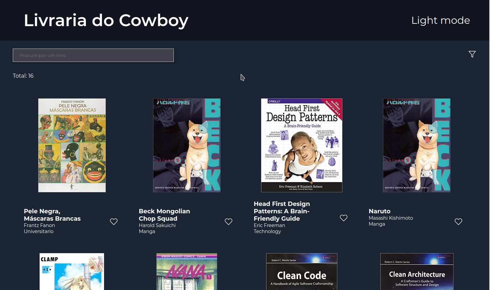

<div align="center">
    
</div>

<h3 align="center">
  🚀 Tera Code Challenge
</h3>


<p align="center">
  <a href="#-projeto">Projeto</a>&nbsp;&nbsp;&nbsp;|&nbsp;&nbsp;&nbsp;
  <a href="#rocket-tecnologias">Tecnologias</a>&nbsp;&nbsp;&nbsp;|&nbsp;&nbsp;&nbsp;
  <a href="#rocket-executando">Executando</a>&nbsp;&nbsp;&nbsp;|&nbsp;&nbsp;&nbsp;
  <a href="#memo-licença">Licença</a>
</p>
<br>

## 💻 Projeto

Esse projeto foi desenvolvido como desafio técnico para vaga de desenvolvedora front end na <a href="https://somostera.com/">Tera</a>. Trata-se de um projeto front end desenvolvido em Vue.js para uma livraria fictícia, a Livraria do Cowboy.

## 🎨 Layout

<p align="center">
    
</p>

## 🚀 Tecnologias

Esse projeto foi desenvolvido com as seguintes tecnologias:

- [Vue.js 3](https://v3.vuejs.org/)
- [Vuex](https://vuex.vuejs.org/)
- [Vue Router](https://router.vuejs.org/)
- [Sass](https://sass-lang.com/)

## 💻 Executando

```bash
# Clone este repositório
$ git clone https://github.com/milena-rosa/tera-code-challenge.git

# Acesse a pasta do projeto no seu terminal
$ cd tera-code-challenge

# Instale as dependências
$ yarn install

# Execute a aplicação
$ yarn serve
```

## 📝 Licença

Esse projeto está sob a licença MIT. Veja o arquivo [LICENSE](LICENSE.md) para mais detalhes.

---

Feito por [Milena Boselli Rosa](https://www.linkedin.com/in/milena-rosa/).
